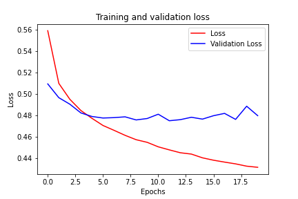
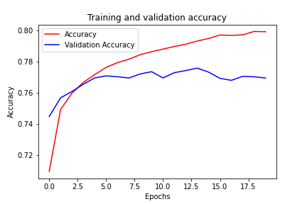

# Twitter sentiment analysis using natural language processing
> Deep learning prediction of twitter sentiment using GloVe

## Table of Contents
* [General Info](#general-information)
* [Technologies Used](#technologies-used)
* [Room for Improvement](#room-for-improvement)
* [Contact](#contact)
<!-- * [License](#license) -->

## General Information
- In this natural language processing project, I will be using a variation of the [Sentiment140 dataset](http://help.sentiment140.com/home), which contains 1.6 million tweets alongside their respective sentiment (0 for negative and 4 for positive).
- I am developing a model to perform classification of the sentiment
- In this project, I am a using a pre-trained GloVe embedding layer which significantly improve the accuracy and decrease overfitting
- The project also contains tokenization, Sequences-truncating and -padding

<!-- If you have screenshots you'd like to share, include them here. -->

## Technologies Used
- Python
- Tensorflow
- Pandas
- Matplotlib

## Room for improvement:
- The model was trained using GRU. Will implement LSTM later.

## Contact
Created by [Miralireza Nabavi](anabavib@asu.edu) - feel free to contact me!
